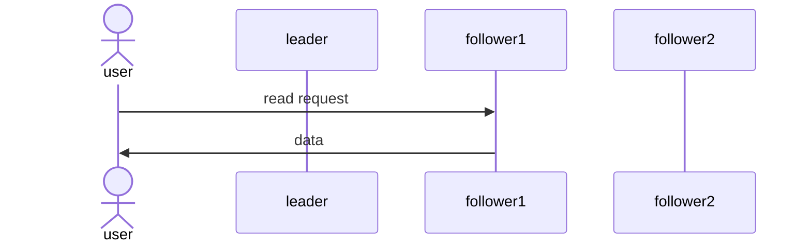
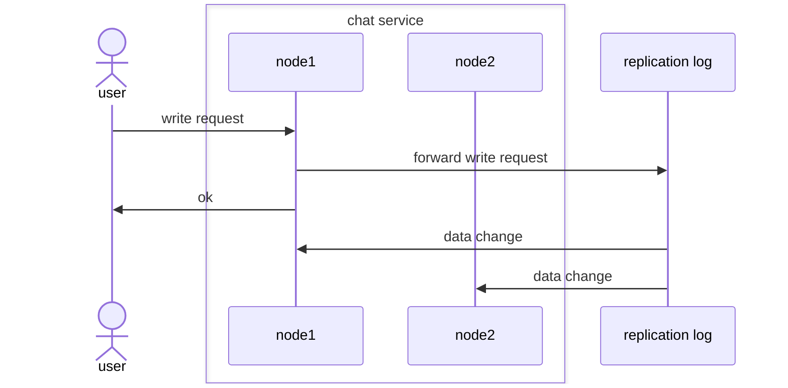
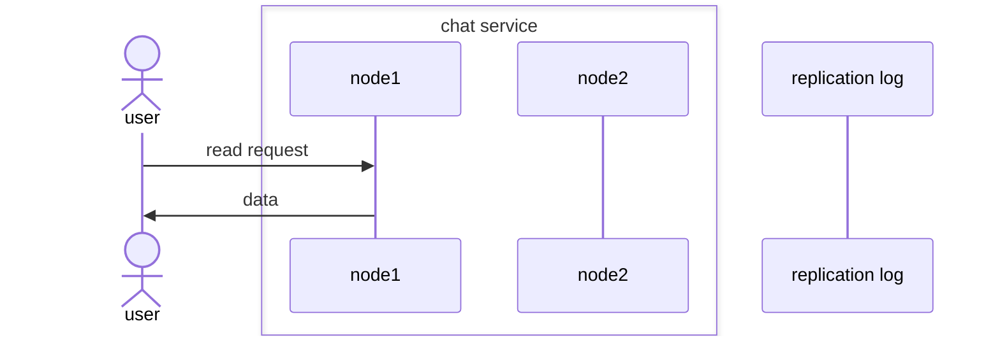

# Goal

This is a proof of concept for a distributed data-driven service with a shared-nothing architecture, where the mechanism for replicating data across nodes is as simple as possible.

As an example, this could be a chat application which needs to be scaled to a large amount of concurrent users - hence the name `chat-cluster`.
However, the application can really be anything where lots of data needs to be served in a scalable way - no attempt was made to build an actual chat application.

For a highly concurrent and scalable chat service, there should be a variable amount of nodes (in our case: kubernetes pods) that a user can connect to for sending and receiving chat messages.
We assume that a user establishes a connection with only one node (e.g. via WebSockets) which they stay connected to.
The user should be able to obtain the already sent chat messages from any node (a read-only request) and also be able to send a message which needs to be distributed to every node (a write request).
We accept some anomalies like read-after-write inconsistencies (user's own chat messages may not be immediately visible to them, or not in the order they sent them).
However, we require eventual consistency, so that all chat messages that were successfully sent will be read by every node at some point in time.
We also require that new nodes that are added while scaling (or performing a rolling update) still obtain all already sent messages and can serve them to users.

The main goal of this PoC is to satisfy these requirements in a simple way without having to implement a complex replication protocol (like Paxos or Raft) ourselves.

# Architecture

## Classical leader-follower architecture

An often used architecture for data-heavy services is having one leader and multiple followers (replicas).
To deal with concurrent write requests, some conflict resolution is typically necessary.
Leader-follower architecture enables this by allowing only the leader to process writes, which then propagates the data change to the followers.


Read-only requests can be served from the leader and any follower.
This allows for a highly concurrent and scalable service by simply starting up additional followers when needed.



When implementing a leader-follower architecture, one has to solve the problem of promoting a follower to a leader (failover), when e.g. the leader crashes or becomes unavailable due to a flaky network connection.
A popular way to perform the failover is applying a leader election protocol like [Paxos](https://en.wikipedia.org/wiki/Paxos_(computer_science)) or [Raft](https://en.wikipedia.org/wiki/Raft_(algorithm)).
However, implementing this comes with a lot of complexity and risk of introducing hard to find errors into the system (notably, Paxos in particular is notoriously complicated).

## Idea: simplification by splitting the leader's responsibilities

In leader-follower architecture, each node can be a leader and a follower during its lifespan (depending on the protocol used, even multiple times).
This means that it has to be able to:
- serve read requests,
- perform write requests and propagate the data change to other nodes, and
- elect or become a leader.

Additionally, this has to be implemented in a way that also works when the cluster is scaled by adding/removing nodes.

This is a lot of responsibilities that all have to be handled by the same node.

The main idea that I wanted to try is splitting the leader's responsibilities into a separate service altogether.
This service's job is then to simply track all write requests and inform all nodes of any data changes - it's simply a replication log.

Write requests are performed by forwarding them to the replication log first, which then informs all the nodes from the chat service.



Read requests work the same way as before and do not involve the replication log.



To make this architecture robust and scalable, however, the replication log itself needs to scale to multiple nodes and likely has to perform failovers internally.
However, this problem is at least separated from the remaining business logic (in the example of a chat service: holding the websocket connection, showing the right chat messages, enabling users to join/leave chat rooms etc.).
The replication log can be improved over time without affecting the business logic as well:
For instance, we could start simple and use a single-node key-value store that persists its data to disk; later, when our requirements change, we can switch to something more scalable and e.g. build the replication log on top of [etcd](https://etcd.io/); or if we need something custom to satisfy our throughput and latency requirements better, we can still implement our own leader-follower architecture but for the replication log only.

## Detailed architecture

TODO

# Running the cluster

## Requirements

- docker
- k3d
- kubectl
- helm

## Set up cluster

Create a local cluster and container registry:

```bash
./k8s/create_cluster.sh
```

Build the containers and publish them to the registry:

```bash
./k8s/publish_images.sh
```

Install the helm chart:

```bash
helm install chat-cluster ./k8s/helm/chat-cluster
```

## "Send" a chat message

For now, sending has to be done by accessing the redis-based message broker
manually:

```bash
kubectl exec -it service/message-broker-service -- redis-cli
127.0.0.1:6379> PUBLISH default-channel "Hello everyone!"
```

To check that it was received, access the `chat-server` service:

```bash
curl localhost:8081/chat-server/messages
```

The message should also be stored and accessible through the `replication-log` service:

```bash
curl localhost:8081/replication-log/messages/default-channel
```

## Confirm that replication log is correctly being used

When a new `chat-server` instance starts up, it should retrieve the list of already sent messages from the replication log. To test this, force a re-deployment:

```bash
kubectl rollout restart deploy chat-server-deployment
```

Once the `chat-server` instances are back up, we can check that they retrieved the previously sent messages:

```bash
curl localhost:8081/chat-server/messages
```

# Delete the cluster after use

```bash
k3d cluster delete mycluster
```
